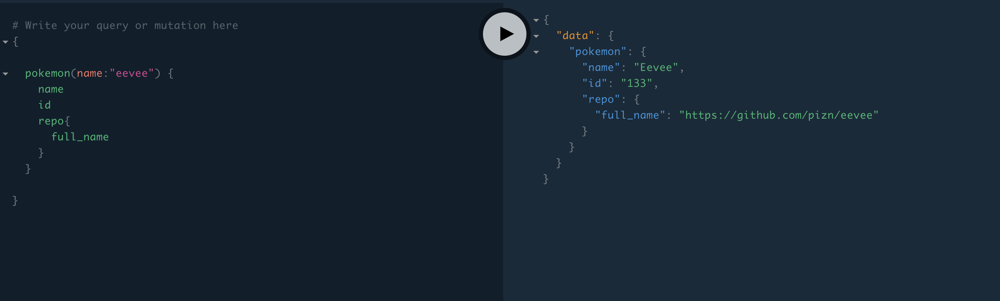

# Torchic


Apollo Server for Showcase of GitHub repos with Pokémon names



## How to develop on local

```shell
$ npm i 
$ node index.js
```

## Resources

- Find out more information on **Deploying Apollo Server with Now**, please refer to the [Deploying Apollo Server to Now](https://zeit.co/guides/deploying-apolloserver-to-now/) guide.

- Check out how to [Deploy any of your applications with ZEIT Now.](https://zeit.co/docs/v2/deployments/basics)